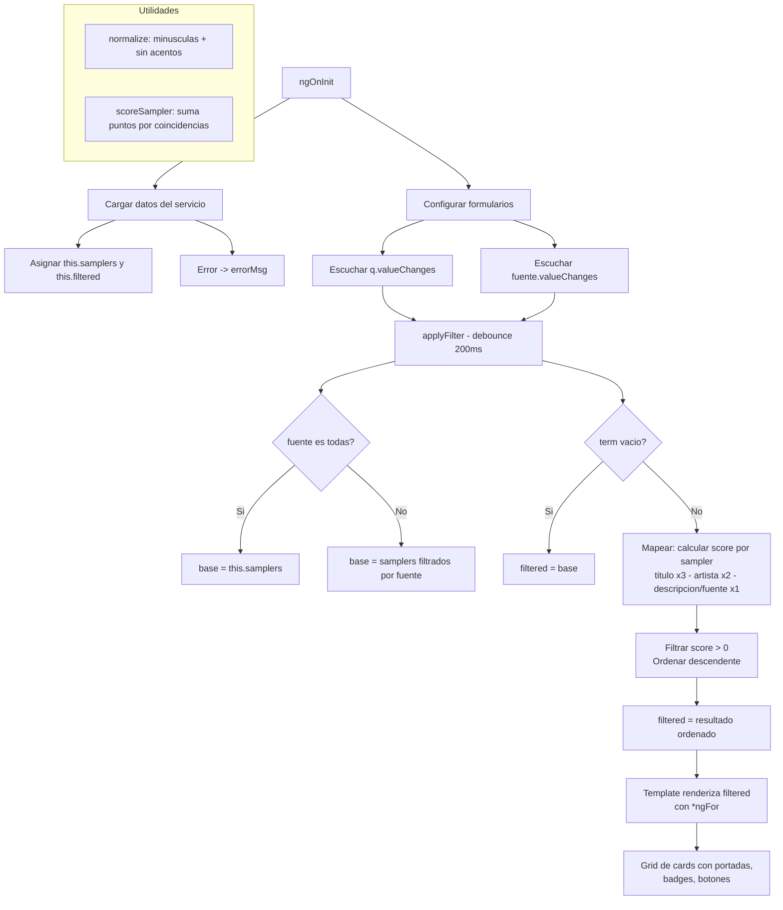

# Sampler 🎵

Este repositorio tendrá la funcionalidad de **buscar y descargar el sample**, entendido como la *muestra predilecta de una canción* que un productor o creador quiere usar como referencia o punto de partida.

## Propósito

La API tendrá la capacidad de buscar ese sample a partir de fuentes populares de streaming y video musical como **YouTube**, **YouTube Music** y **Spotify**. La idea es que puedas encontrar rápidamente la muestra predilecta que estás buscando, sin tener que navegar manualmente por múltiples plataformas.

Además de ser una herramienta creativa, este proyecto funciona como **laboratorio de materia**: práctica de diseño de APIs REST, Angular (servicios, formularios reactivos, componentes), TypeScript y construcción de UI profesional con Bootstrap 5 inspirada en catálogos tipo **Splice**, **Samplette** y **WhoSampled** (búsqueda, filtros, cards con portadas, detalle en offcanvas, etc.).

---

## 🎯 Qué es un Sampler en este Proyecto

En este proyecto, un **sampler** es un objeto que representa la muestra predilecta de una canción, junto con sus metadatos principales:

### Campos del Sampler

- **Título** del sample  
- **Artista** del sample  
- **Fuente** (`YouTube` o `Spotify`)  
- **Enlace** para abrir en la plataforma  
- **Descripción** (comentario de YouTube o contexto del sample)  
- **Portada/Cover** de la canción (imagen representativa) ✨ **NUEVO**
- **Metadatos musicales** opcionales: `key`, `tempo`, `género`, `estilo`  
- **Plataformas relacionadas** (links adicionales de stream o video)  
- **Comentarios** relevantes asociados a la muestra  
- **Índices de popularidad** (para futuras funciones de ranking tipo "Hot Sampled") ✨ **NUEVO**

La UI mostrará estos datos en forma de **cards/grid estilo Splice**, permitiendo explorar, filtrar, buscar y priorizar los samplers según su relevancia para lo que el usuario busca.

---

## 📋 MVP de la API Sampler (V0.0.1)

El MVP se centra en ofrecer un **buscador esencial, robusto y dinámico** que interprete lo que el usuario escribe y devuelva los samplers más relevantes.

### 1️⃣ Buscador Esencial y Robusto

El usuario puede escribir:

- Palabras clave  
- Nombre de artista  
- Título de canción  
- **Sensación** (ej.: "nostalgia", "misterioso", "rítmico")  
- Género o estilo  

El buscador interpreta este input y devuelve los samplers más relevantes según la coincidencia en título, artista, fuente o descripción, ordenados por puntuación de relevancia.

**Ejemplos de búsquedas esperadas:**

- `"nostalgia"` → canciones, playlists o comentarios que transmitan esa idea  
- `"Kanye West"` → canciones, artistas o samples relacionados en Spotify y YouTube  
- `"boombap"` → samples con ese estilo hip-hop específico  
- `"instrumentos de vientos"` → samples que destaquen vientos  
- `"mistico"`, `"contemporaneo"`, `"ritmico"`, `"r&b"`, `"tecno"`, `"melodico"`, `"miedo"` → por sensación

### 2️⃣ Fuentes de Búsqueda

- **YouTube / YouTube Music**  
  - Búsqueda por títulos de videos, comentarios y contexto relacionado  

- **Spotify**  
  - Búsqueda por nombre de artista, canción y playlists (el título de la playlist se usa como entidad que da sentido al contexto del sample)

### 3️⃣ Visualización de Resultados (Estilo Splice/WhoSampled) ✨

Cada sampler devuelto por la API se muestra en una **card estilo catálogo profesional**:

#### Estructura de la Card

```
┌─────────────────────────┐
│  ┌─────────────────────┐ │  ← Portada (200x200px) ✨ NUEVO
│  │                     │ │
│  │      COVER IMG      │ │
│  │                     │ │
│  └──────────┬──────────┘ │
│             │ Fuente     │  ← Badge posicionado
│  TÍTULO CANCIÓN         │
│  Artista Nombre         │  ← Artista en gris
│                         │
│  [Género] [Estilo]      │  ← Badges de metadatos
│  [Key: Bm] [92 BPM]     │
│                         │
│  Descripción breve      │
│  truncada a 2 líneas... │
│                         │
│  [Abrir] [Detalle]      │  ← Botones de acción
└─────────────────────────┘
```

**Características:**
- **Portada/Cover** prominente (200-300px, responsivo)  
- **Título** de la canción  
- **Artista** en texto secundario  
- **Badges de metadatos**: Fuente, Género, Estilo, Key, Tempo (BPM)  
- **Descripción breve** (comentario o contexto, truncado a 2 líneas)  
- **Botones de acción**:
  - "Abrir" (enlace a la plataforma original)
  - "Detalle" (abre offcanvas con más información)

**Grid responsivo** (estilo Splice):
- 📱 **Móvil** (< 576px): 1 columna
- 📱 **Tablet** (576px - 768px): 2 columnas
- 🖥️ **Desktop** (> 768px): 4 columnas

### 4️⃣ Detalle del Sample (Offcanvas)

Al hacer clic en **"Detalle"**, se abre un panel lateral con **3 tabs**:

#### Tab: Plataformas
- Links a todas las plataformas donde está disponible (Spotify, YouTube, etc.)
- Iconos identificables por tipo (`stream` vs `video`)

#### Tab: Comentarios
- Comentarios relevantes de usuarios (ej. extraídos de YouTube)
- Usuario + texto del comentario

#### Tab: Metadatos
- Información técnica completa (título, artista, key, tempo, género, estilo, fuente)
- Formato de definición (`<dl>`) para buena legibilidad

### 5️⃣ Descarga de la Muestra (Sampler)

- Botón o enlace que indique claramente de qué fuente se está extrayendo la muestra  
- En la versión **MVP V0.0.1**, la descarga puede estar **simulada** (enlace, comentario o recurso mock) mientras se define y valida el flujo real de extracción

### 6️⃣ Experiencia de Usuario (UX)

- El buscador debe "tener sentido" respecto a lo que la persona escribe  
- El **ranking prioriza** resultados más cercanos a la intención:  
  - **Coincidencias en título**: x3 puntos de relevancia
  - **Coincidencias en artista**: x2 puntos
  - **Coincidencias en descripción/fuente**: x1 punto
- Se muestran **estados visuales**:
  - `loading` (cargando con spinner)
  - `error` (falló la carga con mensaje)
  - `sin resultados` (no hay coincidencias)
- La UI es **responsive** y **accesible** (roles ARIA, contraste WCAG, disposición mobile-first)

---

## 🔧 Lógica de la Lista de Samplers (Componente `lista-samplers`)

La pantalla principal de catálogo de samplers se resuelve mediante un componente que:

1. **Carga datos** desde un servicio (`SamplerService`) al iniciar  
2. **Configura formularios reactivos** para búsqueda (`q`) y filtro por fuente (`fuente`)  
3. **Aplica una función `applyFilter`** cada vez que cambian la búsqueda o el filtro  
4. **Usa utilidades** para normalizar texto y calcular un puntaje de relevancia (score)

### Explicación del Flujo

#### **Inicio (`ngOnInit`)**

```typescript
ngOnInit() {
  // 1. Llamar al servicio para obtener JSON de samplers
  this.samplerService.getSamplers().subscribe(
    (data) => {
      this.samplers = data;
      this.filtered = [...data];  // Copia inicial para filtered
    },
    (error) => {
      this.errorMsg = 'Error al cargar los samplers';
      this.loading = false;
    }
  );

  // 2. Configurar FormControl reactivos
  this.q = new FormControl('');
  this.fuente = new FormControl('todas');

  // 3. Escuchar cambios en búsqueda y filtro
  this.q.valueChanges.pipe(debounceTime(200)).subscribe(() => this.applyFilter());
  this.fuente.valueChanges.subscribe(() => this.applyFilter());
}
```

#### **Formularios de Búsqueda y Filtro**

- Se escuchan los cambios en `q.valueChanges` (texto de búsqueda)  
- Se escuchan los cambios en `fuente.valueChanges` (YouTube, Spotify o "todas")  
- Cada cambio ejecuta `applyFilter` con **debounce de 200ms**

#### **applyFilter (Filtrado + Ranking)**

```typescript
applyFilter() {
  const term = this.normalize(this.q.value);
  const sourceFilter = this.fuente.value;

  // 1. Definir base según la fuente
  let base = sourceFilter === 'todas' 
    ? this.samplers 
    : this.samplers.filter(s => s.fuente === sourceFilter);

  // 2. Si no hay búsqueda, devolver base completa
  if (!term) {
    this.filtered = base;
    return;
  }

  // 3. Calcular score y ordenar
  const scored = base.map(sampler => ({
    sampler,
    score: this.scoreSampler(sampler, term)
  }));

  // 4. Filtrar solo los con score > 0 y ordenar descendente
  this.filtered = scored
    .filter(item => item.score > 0)
    .sort((a, b) => b.score - a.score)
    .map(item => item.sampler);
}
```

#### **Utilidades**

**`normalize(text: string)`**
- Convierte a minúsculas  
- Elimina acentos (ej. "misterioso" → "misterioso", "Kanye West" → "kanye west")  
- Permite comparación consistente

**`scoreSampler(sampler: Sampler, term: string): number`**
- **Título**: si el término aparece en título → +3 puntos
- **Artista**: si el término aparece en artista → +2 puntos
- **Descripción/Fuente**: si aparece en descripción o fuente → +1 punto
- Retorna la **suma total** de puntos

### 📊 Diagrama "Lista de Samplers"



---

## 🛠️ Stack Tecnológico

| Tecnología | Versión | Uso |
|-----------|---------|-----|
| **Angular** | 20.1 | Framework principal |
| **TypeScript** | 5.8 | Lenguaje tipado |
| **Bootstrap** | 5.3 | Estilos y componentes |
| **SCSS** | - | Estilos avanzados |
| **Reactive Forms** | - | Formularios (FormControl) |
| **RxJS** | - | Observables y operadores (debounceTime) |
| **HttpClient** | - | Solicitudes HTTP |
| **Jasmine + Karma** | - | Testing unitario |

---

## 📁 Estructura del Proyecto

```
sampler-app/
├── src/
│   ├── app/
│   │   ├── services/
│   │   │   └── sampler.ts
│   │   │       ├── SamplerService
│   │   │       ├── Interfaz Sampler (con coverUrl, popularidad, vecesUsado)
│   │   │       └── Métodos: getSamplers()
│   │   │
│   │   ├── components/
│   │   │   ├── lista-samplers/
│   │   │   │   ├── lista-samplers.ts
│   │   │   │   │   ├── Lógica: ngOnInit, applyFilter, scoreSampler
│   │   │   │   │   ├── FormControl: q, fuente
│   │   │   │   │   ├── Arrays: samplers, filtered
│   │   │   │   │   └── Utilidades: normalize, abrirDetalle
│   │   │   │   ├── lista-samplers.html
│   │   │   │   │   ├── Header (navbar con filtros)
│   │   │   │   │   ├── Grid de cards (col-12 col-sm-6 col-md-4 col-lg-3)
│   │   │   │   │   │   ├── Portada/Cover
│   │   │   │   │   │   ├── Título + Artista
│   │   │   │   │   │   ├── Badges (género, estilo, key, tempo)
│   │   │   │   │   │   └── Botones (Abrir, Detalle)
│   │   │   │   │   ├── Estados (loading, error, sin resultados)
│   │   │   │   │   └── Offcanvas de detalle (3 tabs)
│   │   │   │   └── lista-samplers.scss
│   │   │   │       ├── Estilos de card (shadow, hover, transiciones)
│   │   │   │       ├── Responsividad grid
│   │   │   │       └── Badges, offcanvas
│   │   │
│   │   ├── app.ts          # Componente raíz standalone
│   │   ├── app.routes.ts   # Routing (bootstrap con ListaSamplers)
│   │   └── app.html        # Template raíz
│   │
│   ├── assets/
│   │   └── mock/
│   │       └── samplers.json
│   │           └── Array de 2+ samplers con campos: 
│   │               titulo, artista, fuente, enlace, descripcion,
│   │               coverUrl, key, tempo, genero, estilo,
│   │               plataformas[], comentarios[], popularidad, vecesUsado
│   │
│   ├── styles/
│   │   ├── styles.scss     # Estilos globales
│   │   └── variables.scss  # Variables SCSS (colores, tipografía, espaciado)
│   │
│   ├── main.ts             # Bootstrap de la app
│   └── index.html          # HTML principal
│
├── Configuration Files
│   ├── package.json        # Dependencias (Angular, Bootstrap, RxJS, etc.)
│   ├── angular.json        # Config de Angular CLI
│   ├── tsconfig.json       # Config de TypeScript
│   ├── tsconfig.app.json   # Config TS para app
│   └── tsconfig.spec.json  # Config TS para tests
│
└── README.md               # Este archivo
```

---

## 🚀 Instalación y Ejecución

### Requisitos Previos

- **Node.js** 20+ instalado  
- **npm** 10+

### Pasos

#### 1. Clonar el Repositorio

```bash
git clone https://github.com/lucciano12/Sampler.git
cd sampler-app
```

#### 2. Instalar Dependencias

```bash
npm install
```

#### 3. Ejecutar en Desarrollo

```bash
npm start
```

La aplicación estará disponible en **`http://localhost:4200`**

#### 4. Build para Producción

```bash
npm run build
```

Los archivos compilados estarán en la carpeta **`dist/sampler-app`**

#### 5. Ejecutar Tests (Opcional)

```bash
npm test
```

---

## 📖 Cómo Usar la Aplicación

### 1. Buscar Samplers

- Escribe en el **input de búsqueda** ("Busca por título, artista, sensación, género...")  
- El buscador filtrará y ordenará los resultados en **tiempo real** (con debounce de 200ms)
- Los resultados se ordenan por **relevancia** (titulo > artista > descripción)

### 2. Filtrar por Fuente

- Usa el **selector dropdown** "Todas las fuentes" para elegir entre:
  - `Todas las fuentes` (todos los samplers)
  - `YouTube` (solo YouTube)
  - `Spotify` (solo Spotify)
- El filtro se aplica **inmediatamente** y se combina con la búsqueda

### 3. Ver Detalle de un Sample

- Haz clic en el botón **"Detalle"** de cualquier tarjeta
- Se abrirá un **panel lateral** (offcanvas) con 3 tabs:
  - **Plataformas**: Links para abrir en cada plataforma
  - **Comentarios**: Comentarios de usuarios
  - **Metadatos**: Información técnica completa

### 4. Abrir en Plataforma Original

- Haz clic en el botón **"Abrir"** para ir directamente al link en YouTube o Spotify
- Se abre en una **nueva pestaña** (target="_blank")

---

## 💡 Idea Futura: "Hot Sampled" / Trending

Para las próximas versiones (Fase 5+), se planea agregar:

### Funcionalidad
- **Catálogo de "Hot Sampled"**: Mostrar los samplers más populares/trending
- **Sistema de ranking**: Usar campos como `popularidad` (0-100) y `vecesUsado` para ordenar
- **Vista de tendencias**: Tab separado o sección en el home con filtros por período

### Filtros por Período
- 📅 Día
- 📅 Semana
- 📅 Mes
- 📅 Año

### Visualmente
- Badge **"🔥 Hot"** en cards populares (popularidad > 80)
- Sección destacada en el home antes del buscador
- Opción de toggle: "Todos" vs "Trending"

### Beneficio
Permitirá a los usuarios descubrir samplers que están siendo muy utilizados en la comunidad de productores.

---

## 📈 Mejoras Planificadas

### 🟢 Corto Plazo (v0.1.0)
- [ ] Agregar `coverUrl` a interfaz `Sampler`
- [ ] Actualizar `samplers.json` con URLs de portadas
- [ ] Reemplazar template `lista-samplers.html` con grid estilo Splice
- [ ] Agregar estilos SCSS para cards mejoradas
- [ ] Testear responsividad en móvil, tablet, desktop
- [ ] Lazy loading de imágenes para optimizar performance

### 🟡 Mediano Plazo (v0.2.0 - v0.3.0)
- [ ] Integración con **APIs oficiales de Spotify** (búsqueda, metadata, covers)
- [ ] Integración con **YouTube Data API** (búsqueda, comentarios)
- [ ] Página de **home con catálogo de "Hot Sampled"**
- [ ] Sistema de **favoritos** (guardar samplers con localStorage)
- [ ] Búsqueda avanzada (filtros por key, tempo, rango de BPM)
- [ ] Historial de búsquedas recientes
- [ ] Más datos en mock JSON para testing completo

### 🔵 Largo Plazo (v0.4.0+)
- [ ] **Autenticación** de usuarios (login, registro)
- [ ] Sistema de **comentarios propios** de usuarios
- [ ] Generación de **playlists/colecciones** de samplers
- [ ] **Estadísticas** de búsqueda y trending análisis
- [ ] **Mobile app** (React Native o Flutter)
- [ ] Base de datos real (MongoDB, PostgreSQL)
- [ ] Backend API real (Node.js, Python, etc.)

---

## 📚 Objetivo Educativo

Este proyecto sirve como **laboratorio de materia** para practicar:

### Frontend
- **Angular 20**: 
  - Componentes standalone
  - Reactive Forms (FormControl)
  - Servicios e inyección de dependencias
  - Ciclos de vida (ngOnInit, ngOnDestroy)
  - Data binding (interpolación, property binding, event binding)

- **TypeScript**:
  - Interfaces y tipos genéricos
  - Decoradores (@Component, @Injectable)
  - Union types, optional chaining

- **Bootstrap 5**:
  - Layout responsivo (grid system)
  - Componentes (cards, offcanvas, tabs, badges, navbars)
  - Utilidades (spacing, typography, colors)
  - Classes for accessibility

- **SCSS**:
  - Variables y mixins
  - Anidamiento (nesting)
  - Media queries
  - Pseudo-clases (:hover, :focus)

### Backend/Datos
- **REST APIs**:
  - Estructura de datos (JSON)
  - Patrones de comunicación HTTP
  - HttpClient y Observables

- **RxJS**:
  - Observables y subscriptions
  - Operadores (debounceTime, map, filter)
  - Error handling

### UX/UI
- **Catálogos musicales** tipo Splice/WhoSampled
- **Búsqueda y ranking** de relevancia
- **Estados visuales** (loading, error, empty)
- **Accesibilidad** (ARIA, contraste, mobile-first)
- **Responsividad** y diseño adaptativo

---

## 🤝 Contribución

Este es un proyecto educativo. Si deseas contribuir o sugerir mejoras:

1. Abre un **Issue** describiendo la mejora o bug
2. Haz un **Fork** del repositorio
3. Crea una rama con tu feature (`git checkout -b feature/tu-mejora`)
4. Commit tus cambios (`git commit -m 'Agrega tu mejora'`)
5. Push a la rama (`git push origin feature/tu-mejora`)
6. Abre un **Pull Request**

---

## 📄 Licencia

Este proyecto está bajo licencia **MIT**. Consulta el archivo `LICENSE` para más detalles.

---

## 📧 Contacto

- **Autor**: lucciano12  
- **GitHub**: https://github.com/lucciano12/Sampler  
- **Email**: prado.lucciano@gmail.com


¡Gracias por tu interés en el proyecto **Sampler**! 🎵✨
